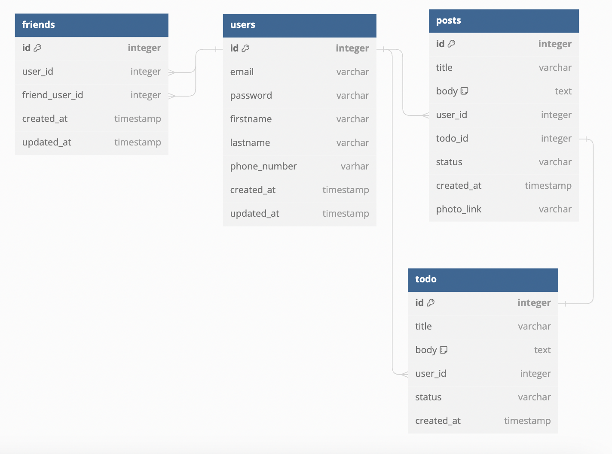

# BeReal Clone Tasks Manager Backend

## BackEnd

<a href="https://github.com/jinjunoh">Jin Jun Oh</a>

  

<h1>STACKS</h1>

BACKEND

  
   
  
   
  
  
  

<h2>ERD diagram</h2>

### `Auth`
- Implemented robust email and password validation checks to ensure the integrity and security of user credentials. 
- Sign Up: Utilized the industry-standard bcrypt hashing algorithm to encrypt and securely store user passwords, enhancing data protection 
- Login: Implemented token-based authentication using the widely adopted jsonwebtoken library, ensuring secure and reliable user authentication. 

### `Details`
- Allowed useres to directly post and get from AWS S3 minimizing data flow and optimizing data queries from client side by configuring a secure URL from the backend
- Deployed the Backend server on AWS EC2 instance inside an auto-scaling group linked with an Elastic Load Balancer to enable a scaling cloud infrastructure design

### `Mypage`
- User Profile: Implemented a user profile page where users can view and update their personal information such as name, email, birthday, and phone number.
- Todo History: Provided a comprehensive order history feature that allows users to view their past task, including details such as completion date, status, and media.
